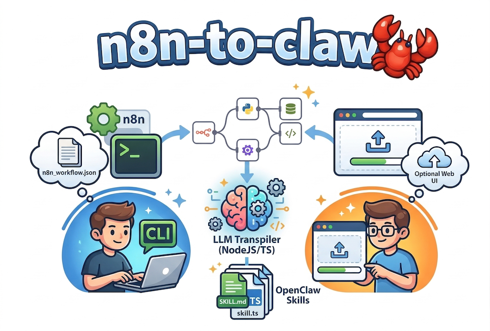

<div align="center">
  
  <h1>n8n-to-claw</h1>
  <p><strong>Turn n8n workflows into OpenClaw skills</strong></p>
  <p>
    A <strong>CLI</strong> that converts <a href="https://n8n.io">n8n</a> workflow JSON into <a href="https://openclaw.ai">OpenClaw</a>-compatible skills (<code>SKILL.md</code> + <code>skill.ts</code>). An LLM handles transpilation; the main interface is the CLI, with an optional <strong>web UI</strong> (see below) for the same pipeline in the browser.
  </p>
  <p>
    <a href="https://github.com/just-claw-it/n8n-to-claw/actions/workflows/ci.yml?branch=main">
      
    </a>
    <a href="LICENSE">
      
    </a>
  </p>
</div>

## Requirements

- Node.js ≥ 20
- An OpenAI-compatible LLM API (OpenAI, [Groq](https://console.groq.com/docs/models), OpenRouter, Ollama, etc.)

## Install

Install from a clone of this repository (the package is not published to npm yet):

```bash
git clone https://github.com/just-claw-it/n8n-to-claw.git
cd n8n-to-claw
npm install
npm run build
```

Run the CLI:

```bash
node dist/cli/index.js convert workflow.json
```

Optional — install the `n8n-to-claw` command globally from the repo:

```bash
npm install -g .
n8n-to-claw convert workflow.json
```

## Usage

**From a local workflow JSON file:**
```bash
n8n-to-claw convert workflow.json
```

**From the n8n REST API:**
```bash
n8n-to-claw convert \
  --n8n-url https://my-n8n.example.com \
  --api-key <n8n-api-key> \
  --workflow-id <workflow-id>
```

**Useful flags:**
```bash
# Parse only — summarise nodes/warnings, skip LLM
n8n-to-claw convert workflow.json --dry-run

# Print full IR + prompt + known node list, then exit (no LLM call)
n8n-to-claw convert workflow.json --inspect

# Print LLM prompt + raw response + tsc output to stderr
n8n-to-claw convert workflow.json --verbose

# Override output directory
n8n-to-claw convert workflow.json --output-dir ~/my-skills

# Overwrite an existing skill output without prompting
n8n-to-claw convert workflow.json --force

# Print CLI version
n8n-to-claw --version

# Verify LLM_* and that the OpenAI-compatible endpoint is reachable (use before convert, especially local Ollama)
n8n-to-claw check-llm
```

**Debug logging:**
```bash
DEBUG=n8n-to-claw n8n-to-claw convert workflow.json
```

## Environment variables

Required:

| Variable | Description |
|---|---|
| `LLM_BASE_URL` | OpenAI-compatible API base URL (e.g. `https://api.openai.com/v1`) |
| `LLM_API_KEY` | API key |
| `LLM_MODEL` | Model name (e.g. `gpt-4o`, `llama-3.3-70b-versatile` on Groq, `anthropic/claude-3.5-sonnet` via OpenRouter) |

Optional:

| Variable | Default | Description |
|---|---|---|
| `LLM_TIMEOUT_MS` | `60000` | Per-request LLM timeout in milliseconds |
| `LLM_MAX_RETRIES` | `3` | Max retries on 429 rate-limit or 5xx errors |
| `LLM_MAX_TOKENS` | `4096` | Max completion tokens per request; lower values can finish sooner on slow local models (Ollama) but may truncate output |
| `DEBUG` | — | Set to `n8n-to-claw` to enable structured debug logging |
| `N8N_TO_CLAW_FORCE_LLM` | — | If `1`, skip deterministic templates and always call the LLM |

Copy [`.env.example`](.env.example) to `.env`, fill in values, then `source .env` (or export the variables in your shell).

After setting `LLM_*`, run `n8n-to-claw check-llm` to confirm connectivity. That uses the same env as `convert` and fails fast with hints if the URL is wrong, Ollama is not running, or a remote agent cannot reach your machine’s `localhost`.

Example (OpenAI):
```bash
export LLM_BASE_URL=https://api.openai.com/v1
export LLM_API_KEY=sk-...
export LLM_MODEL=gpt-4o
```

Example ([Groq / GroqCloud](https://console.groq.com/docs/models) — not xAI Grok):
```bash
export LLM_BASE_URL=https://api.groq.com/openai/v1
export LLM_API_KEY=gsk_...
export LLM_MODEL=llama-3.3-70b-versatile
```

Example (local **Ollama** — transpile sends a **large** system prompt + workflow; an 8B CPU model can take many minutes per attempt. `ollama run "ping"` is not comparable workload.)

```bash
export LLM_BASE_URL=http://127.0.0.1:11434/v1
export LLM_API_KEY=ollama
export LLM_MODEL=llama3.1:8b
export LLM_TIMEOUT_MS=900000
# Optional: cap output length to reduce generation time (may truncate; retry may still help)
# export LLM_MAX_TOKENS=2048
```

## Output

Skills are written to `~/.openclaw/workspace/skills/<workflow-name>/`:

```
~/.openclaw/workspace/skills/my-workflow/
├── SKILL.md                  # OpenClaw skill descriptor
├── skill.ts                  # Node.js implementation
├── credentials.example.env   # Generated if the workflow uses credentials
└── warnings.json             # List of every degraded/stubbed node
```

If the generated `skill.ts` fails TypeScript validation after two LLM attempts, the output goes to `draft/` instead:

```
~/.openclaw/workspace/skills/my-workflow/
├── draft/
│   ├── SKILL.md
│   └── skill.ts              # Fix TypeScript errors, then move up one level
└── warnings.json
```

## Model recommendation

**Minimum:** GPT-4o or Claude Sonnet tier.

Small Ollama models (7B–13B) will produce syntactically broken or logically incorrect `skill.ts` output. The tool will catch compilation errors and retry once with the error injected into the prompt, but logical correctness is not guaranteed even with large models — always review generated skills before using them.

## Pipeline

```
┌─────────┐    ┌─────────────────┐    ┌───────────────────────┐    ┌─────────┐
│  Input  │───▶│  Parse (IR)     │───▶│  Transpile (LLM)      │───▶│ Package │
│ file/   │    │  normalize n8n  │    │  prompt → SKILL.md +  │    │ write   │
│ n8n API │    │  JSON to IR     │    │  skill.ts → tsc check │    │ to disk │
└─────────┘    └─────────────────┘    └───────────────────────┘    └─────────┘
```

### Graceful degradation

| Node situation | Behaviour |
|---|---|
| Unknown node type | Emits a stub with the original node JSON and a `TODO` comment |
| Credential references | Generates `credentials.example.env` with placeholder env var names |
| Webhook trigger | Maps to OpenClaw native webhook support |
| Database node (`postgres`, `mysql`, etc.) | Attempts bash CLI fallback (`psql`, `sqlite3`); falls back to `TODO` stub |
| n8n expression (`={{ ... }}`) | Annotated in generated code as requiring runtime resolution |
| Broken TypeScript (attempt 1) | Retries once with the compiler error injected into the prompt |
| Broken TypeScript (attempt 2) | Written to `draft/` with a warning |

All degraded nodes are listed in `warnings.json` with name, type, and reason.

## Node coverage

A **[generated dashboard](docs/node-coverage.md)** lists every node type that appears in `test-fixtures/`, its resolved category, and whether it was mapped via `EXACT_MAP`, a prefix/suffix fallback, or `unknown`. Regenerate it with `npm run coverage:nodes` (requires a successful `npm run build`).

**479 node types** are explicitly mapped (sourced from n8n v2.13 `packages/nodes-base/package.json` + `@n8n/n8n-nodes-langchain`). Run `n8n-to-claw convert <file> --inspect` to see the full list.

Additionally, **suffix and prefix fallback rules** ensure that even unmapped nodes get reasonable defaults:
- Any node type ending in `Trigger` → automatically categorized as a trigger
- Any `@n8n/n8n-nodes-langchain.*` node → automatically categorized as transform
- Community/custom nodes → categorized as `unknown` with full JSON passed to the LLM

| Category | Count | Examples |
|----------|------:|---------|
| **Triggers** | 108 | `scheduleTrigger`, `githubTrigger`, `shopifyTrigger`, `telegramTrigger`, `stripeTrigger`, `slackTrigger`, + all service-specific triggers |
| **HTTP / integrations** | 230 | `slack`, `notion`, `hubspot`, `salesforce`, `shopify`, `twitter`, `whatsApp`, `zoom`, `jira`, + 220 more SaaS integrations |
| **Transform** | 61 | `set`, `code`, `merge`, `filter`, `sort`, `aggregate`, `aiTransform`, LangChain models/agents/chains |
| **Database** | 30 | `postgres`, `mySql`, `mongoDb`, `redis`, `snowflake`, `elasticsearch`, `oracleSql`, `googleBigQuery`, `databricks`, `azureCosmosDb` |
| **File / storage** | 18 | `googleDrive`, `s3`, `awsS3`, `dropbox`, `ftp`, `ssh`, `azureStorage`, `nextCloud`, `microsoftSharePoint` |
| **Email** | 16 | `gmail`, `emailSend`, `sendGrid`, `mailchimp`, `mailgun`, `awsSes`, `brevo`, `mandrill` |
| **Flow / control** | 12 | `if`, `switch`, `wait`, `executeWorkflow`, `noOp`, `stopAndError` |
| **Webhook** | 4 | `webhook`, `formTrigger`, `form`, `respondToWebhook` |

## Examples

The [`examples/`](examples/) directory contains sample conversion output so you can see exactly what this tool produces — no LLM needed.

| Example | Input workflow | Trigger | What it shows |
|---------|---------------|---------|---------------|
| [github-pr-review-notifier](examples/github-pr-review-notifier/) | [github-webhook-to-slack.json](test-fixtures/github-webhook-to-slack.json) | Webhook | Webhook → stdin, IF → exit codes, Slack API |
| [daily-hacker-news-digest](examples/daily-hacker-news-digest/) | [daily-hacker-news-digest.json](test-fixtures/daily-hacker-news-digest.json) | Schedule | HTTP fetching, Code node, Email TODO stub |

You can also try the parse stage on any fixture without an LLM:

```bash
n8n-to-claw convert test-fixtures/ai-support-chatbot.json --dry-run
n8n-to-claw convert test-fixtures/sync-crm-with-custom-nodes.json --inspect
```

## Known limitations

- No support for n8n sub-workflows that require cross-workflow state
- n8n expressions (`={{ $json.field }}`) are passed through as opaque strings — generated code will annotate them but cannot auto-resolve them
- The tool does not authenticate OAuth credentials — `credentials.example.env` provides env var placeholders only
- Large workflows (50+ nodes) may exceed LLM context limits on smaller models
- Community nodes not in the [mapped list](#node-coverage) will produce `unknown_node_type` stubs (their full JSON is still passed to the LLM)

## Web UI

A web interface lets you upload n8n workflows, preview the parse results, and run the full transpilation using your own LLM API key — no global CLI install required.

```bash
cd web
npm install
npm run dev       # Vite dev server + Express API (see terminal for URLs)
```

On **Windows PowerShell 5.x**, chain commands with `;` instead of `&&` (or use **PowerShell 7+**, or **cmd.exe**).

In development, open the Vite URL (typically **http://localhost:5173**). The Express API listens on port **3847** by default.

You can:

1. Upload or paste n8n workflow JSON, or load an example (when running from the repo, fixtures are served from `/fixtures`).
2. Review parse results — nodes, edges, credentials, warnings, and prompt preview.
3. Choose an **OpenAI-compatible provider** preset (OpenAI, Groq, OpenRouter, Ollama local or Docker host, xAI Grok, etc.), pick a **model** from the list or enter a **custom model id**, and **override the API base URL** if you use a proxy or tunnel. The API key is optional for local Ollama.
4. Transpile and download the generated `SKILL.md` + `skill.ts`.

The browser may remember the last **provider, base URL, and model** in `localStorage` (not the API key).

For production deployment:

```bash
# From the repo root — build the CLI so the server can import ../dist/
npm ci && npm run build

cd web
npm ci
npm run build          # Vite → web/dist/client/
npm start              # Express: API + static UI on PORT (default 3847)
```

Your API key is sent only with each transpile request to the server; it is not written to disk or logged by the app.

### Docker

Run the full web UI in a container (no local Node.js install). The image includes the compiled CLI (`dist/`), TypeScript for `tsc` validation, the Express API, and the Vite-built frontend.

```bash
# From the repo root
docker compose up --build
# Open http://localhost:3847
```

Or with plain Docker:

```bash
docker build -t n8n-to-claw .
docker run --rm -p 3847:3847 n8n-to-claw
```

- **Health check:** `GET /health` returns `{"ok":true,"service":"n8n-to-claw-web"}` (used by the container `HEALTHCHECK`).
- **Port:** set `PORT` if you need a different listen port inside the container (default `3847`). Map host ports with `-p 80:3847` or adjust `docker-compose.yml`.
- **Bind address:** the server listens on `0.0.0.0` by default so it is reachable from outside the container. Set `HOST=127.0.0.1` only if you deliberately want localhost-only.

**Oracle Cloud Free Tier (or any cloud VM):** Install Docker, copy the repo (or pull a pre-built image), `docker compose up -d --build`, and open the instance **ingress / security list** for TCP **3847** (or whatever host port you map). The UI still uses **bring-your-own-key** for the LLM — you do not need to put API keys on the server.

- **ARM (Ampere A1):** build on the instance (`docker build` runs natively) or use `docker buildx build --platform linux/arm64`.
- **x86 VM:** use `linux/amd64` when cross-building from another architecture.

## Documentation

- [Architecture deep-dive](docs/architecture.md) — pipeline stages, design decisions, dependency rationale
- [IR schema reference](docs/ir-schema.md) — field-by-field WorkflowIR documentation
- [Changelog](CHANGELOG.md) — release history

## Community

- [Contributing](CONTRIBUTING.md) — pull requests, new node mappings, code style
- [Security policy](SECURITY.md) — how to report vulnerabilities responsibly
- [Issues](https://github.com/just-claw-it/n8n-to-claw/issues) — bug reports and feature requests

## License

[MIT](LICENSE)

## Development

After [installing](#install) dependencies and building, run tests and typecheck:

```bash
npm test
npm run typecheck
```

### Prompt evals (versioned prompt quality checks)

The transpile system prompt is explicitly versioned (`PROMPT_VERSION` in
`src/transpile/prompt.ts`). To make prompt changes reviewable, the repo includes
a fixture-based eval harness in `src/evals/`.

Commands:

```bash
# Print the current prompt eval report to stdout
npm run eval:prompt

# Regenerate the baseline snapshot for the current prompt version
npm run eval:prompt:update

# Run deterministic transpile-quality scenarios (parseability/retry/outcome)
npm run eval:quality

# Regenerate the transpile quality baseline snapshot (same prompt version tag)
npm run eval:quality:update
```

The prompt-eval baseline path is `docs/prompt-evals/prompt-v1-baseline.json`. When
this file is present, `src/evals/prompt-eval.test.ts` enforces exact parity with
the generated report.

The transpile-quality baseline path is
`docs/prompt-evals/transpile-quality-v1-baseline.json`. When present,
`src/evals/transpile-quality-eval.test.ts` enforces parity only when
`report.tscAvailable` matches the baseline (so machines without `tsc` on PATH do
not fail the snapshot).

**Golden transpile snapshots:** `test-fixtures/golden-transpile/<fixture-stem>/`
holds expected `SKILL.md` + `skill.ts` for each workflow JSON in `test-fixtures/`.
`src/evals/golden-transpile.test.ts` mocks the LLM to return those files and
asserts `transpile()` output matches (regression guard for the output parser and
pipeline). The integration test loads the same files for the notify-slack
end-to-end case. Update the golden files when you intentionally change expected
mock output, then run `npm test`.

Or run `./scripts/setup.sh` from the repo root to install, typecheck, test, and build in one go.

CI runs on **Node.js 20** and **22** (see [`.github/workflows/ci.yml`](.github/workflows/ci.yml)): typecheck, tests, CLI build, web install/typecheck/build, and a Docker image build on Node 20.

### Web UI development

```bash
cd web
npm install
npm run dev   # Vite on :5173 + Express on :3847
```
